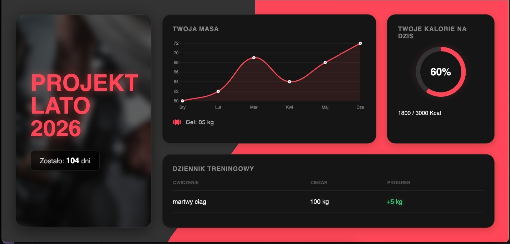

# 🏋️‍♂️ Projekt Lato 2026 Dashboard


Osobiste, "self-hosted" centrum dowodzenia do monitorowania progresu sylwetkowego. Minimalistyczny dashboard stworzony z myślą o wydajności i estetyce Dark Mode, zoptymalizowany pod monitory o wysokim odświeżaniu.


*(Tutaj wrzuć zrzut ekranu swojego dashboardu i nazwij go preview.png)*

## 🎯 Główne Funkcje

* **⏳ Licznik do Deadline'u:** Dynamiczne odliczanie dni do 1 czerwca 2026 (JavaScript).
* **📈 Wizualizacja Masy:** Interaktywny wykres liniowy oparty na bibliotece **Chart.js** (płynne animacje).
* **🔥 Macro Tracker:** Stylowy wskaźnik kołowy (CSS Conic Gradient) do śledzenia dziennego spożycia kalorii.
* **📝 Dziennik Treningowy:** Tabela logów z wyróżnieniem progresu siłowego (kolorowanie składni dla przyrostów).
* **🎨 Cyberpunk/Gym Aesthetic:**
    * Ciemny motyw (#0f0f0f) oszczędzający oczy.
    * Neonowe akcenty (#ff4757).
    * Efekt "Glassmorphism" i rozmycia tła (Blur filters).
    * Responsywny CSS Grid (działa na PC i Mobile).

## 🛠️ Tech Stack

Projekt napisany w czystym kodzie (Vanilla), bez zbędnych frameworków, co zapewnia błyskawiczne ładowanie.

* **HTML5** - Semantyczna struktura.
* **CSS3** - CSS Grid, Flexbox, Variables, CSS Filters.
* **JavaScript (ES6+)** - Logika licznika i obsługa wykresów.
* **Chart.js** - Renderowanie wykresów na elemencie Canvas.

## 🚀 Jak uruchomić (Localhost)

Ponieważ jest to aplikacja statyczna, nie wymaga instalacji Node.js ani Pythona.

1.  Sklonuj repozytorium:
    ```bash
    git clone https://github.com/Mrucxek21/projekt-lato-2026
    cd projekt-lato-2026
    ```

2.  Uruchom plik `index.html` w dowolnej przeglądarce.

## ⚙️ Konfiguracja (Sudo Mode)

Wszystkie dane są obecnie hardcodowane (dla maksymalnej prostoty), edycja odbywa się bezpośrednio w kodzie.

### Zmiana Daty Końcowej
W pliku `script.js`:
```javascript
const targetDate = new Date('June 1, 2026').getTime();
